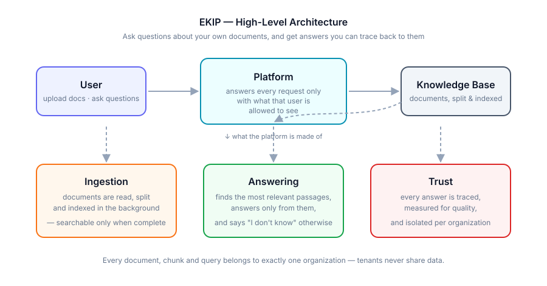
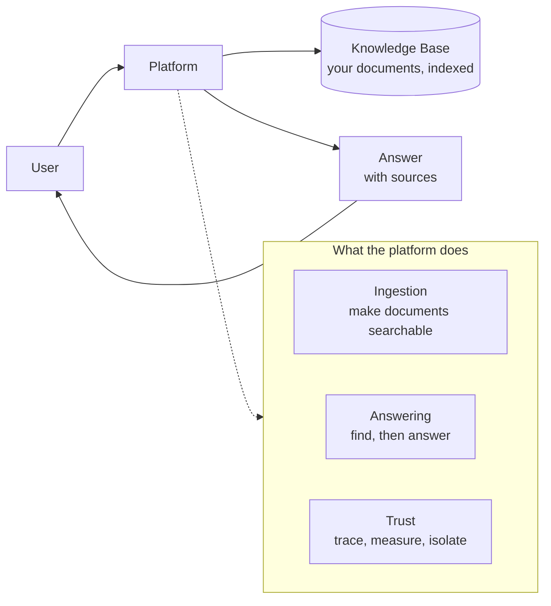
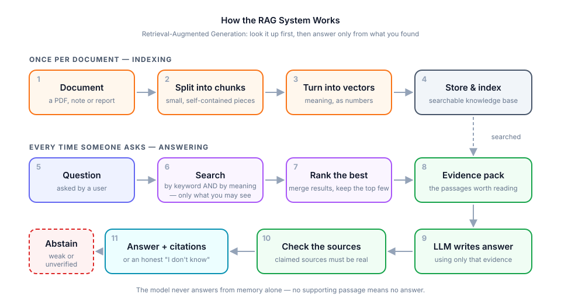
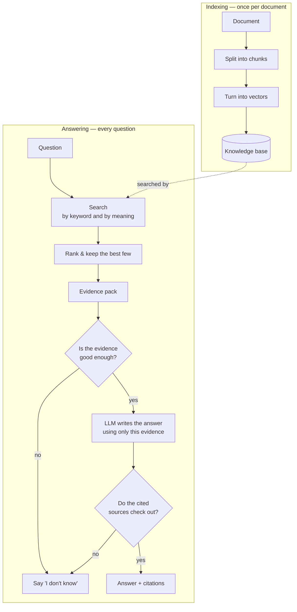

# EKIP — Enterprise Knowledge Intelligence Platform (MVP / POC)

This is a **scoped-down MVP** of the full EKIP blueprint. The goal of this
codebase is to prove out the *shape* of every major subsystem described in
the foundation doc — tenancy, permission-aware ingestion, hybrid retrieval,
citation-enforced generation, tracing, and evaluation — with minimal,
readable, modular code. It intentionally does **not** implement production
concerns yet (retries, real OCR, real reranker models, real auth provider,
CI eval gates, observability backends). Those are called out as `# TODO(prod)`
comments throughout the code so the next phase is obvious.

---

## Architecture (high level)



EKIP has three parts, and the whole system is easiest to understand through them:



| Part | What it does | Why it matters |
|---|---|---|
| **Ingestion** | Reads uploaded documents, breaks them into small passages, and indexes them in the background | A document becomes searchable only when it is *fully* indexed — half-indexed documents would silently give wrong answers |
| **Answering** | Finds the passages relevant to a question and writes an answer using only those passages | This is the RAG loop — see the next section |
| **Trust** | Records what happened for every query, measures answer quality over time, and keeps each organization's data separate | An answer you can't verify or explain isn't usable in an enterprise |

Two rules hold everywhere in the system:

- **Tenant isolation** — every document, passage and question belongs to exactly
  one organization. A search is filtered by who is asking *before* it runs, not
  after, so a user can never touch data they aren't entitled to.
- **Grounded or silent** — the system either answers from retrieved evidence and
  shows you that evidence, or it says it doesn't know. It never fills the gap
  with a guess.

## How the RAG system works



RAG — *Retrieval-Augmented Generation* — means the model doesn't answer from
memory. It looks things up in your documents first, and answers only from what
it found.



### The steps

**Indexing — done once, in the background, when a document is uploaded**

| # | Step | What happens |
|---|---|---|
| 1 | **Upload** | The document is stored and tagged with its organization and who may read it |
| 2 | **Parse** | The file's text is extracted from PDF / TXT / Markdown |
| 3 | **Chunk** | Text is split into small, self-contained passages that follow the document's headings, so each passage still makes sense alone |
| 4 | **Embed** | Each passage is converted into a vector — a numeric fingerprint of its meaning |
| 5 | **Index** | Passages and vectors are stored so they can be searched by both words and meaning |
| 6 | **Publish** | Only now is the document marked ready and made searchable |

**Answering — done live, every time someone asks**

| # | Step | What happens |
|---|---|---|
| 1 | **Screen the question** | Empty, oversized or manipulative questions ("ignore your instructions…") are rejected up front |
| 2 | **Keyword search** | Finds passages containing the actual words asked about — good for names, codes, exact terms |
| 3 | **Meaning search** | Finds passages that mean the same thing in different words — good for paraphrased questions |
| 4 | **Merge the two** | The two ranked lists are fused into one; passages both methods liked rise to the top |
| 5 | **Rerank** | The shortlist is re-scored against the question, and only the best few survive |
| 6 | **Check sufficiency** | If even the best passage is a weak match, the system stops here and abstains rather than guessing |
| 7 | **Build the evidence pack** | The surviving passages are assembled into the prompt, each labelled with its source |
| 8 | **Generate** | The LLM writes an answer using only that evidence, and marks which passage each claim came from |
| 9 | **Verify the citations** | Every claimed source is checked against the evidence actually supplied — invented sources are thrown out |
| 10 | **Answer or abstain** | If nothing verifies, the model gets one chance to restate its sources; if it still can't, the system abstains |
| 11 | **Record the trace** | The question, what was searched, what was chosen and how long it took are all saved, so the answer can be explained later |

Steps 2–4 are why this is called **hybrid retrieval**: keyword search and meaning
search fail in different ways, so running both and merging them catches what
either alone would miss.

Steps 6, 9 and 10 are the honesty mechanism. Most RAG failures aren't retrieval
failures — they're a model confidently answering from thin evidence. Here, weak
evidence and unverifiable citations both lead to the same place: *"I don't
know."*

## What's implemented in this POC

- Multi-tenant data model (Organization → KnowledgeBase → Document →
  DocumentVersion → Chunk) with `organization_id` on every tenant table.
- Simple JWT auth + membership/role model (RBAC skeleton).
- Document upload → async ingestion pipeline (Celery + Redis) →
  parse (LangChain loaders for PDF/TXT/MD) → chunk (LangChain
  `RecursiveCharacterTextSplitter`, heading-aware) → embed → store
  (Postgres + pgvector).
- Document-level ACLs enforced **before** retrieval (not post-filtered).
- Hybrid retrieval: Postgres full-text (lexical) + pgvector (dense),
  combined with Reciprocal Rank Fusion (RRF).
- A pluggable reranker interface with a simple cross-encoder-style stub.
- Grounded generation: evidence pack → prompt → local LLM (Ollama) →
  citation extraction/validation → abstention if evidence is weak.
- A `RetrievalTrace` row persisted per query (query, scores, chosen
  chunks, latency), plus optional **LangSmith** tracing on the same calls
  (`@traceable` on `retrieve()`, `generate()`, `answer_question()`) — off
  by default, on if you set `LANGCHAIN_API_KEY`.
- A tiny deterministic evaluation harness (Recall@K, citation validity)
  you can run against a hand-written eval set.
- **Automated tenant-isolation self-check** (`app/services/security/tenant_isolation_check.py`):
  plants a document in a throwaway second organization and confirms it
  cannot be retrieved from the calling org, plus confirms a document with
  no ACL rows is invisible to everyone. Runnable via the API, the
  frontend's Security tab, or as a pytest integration test.
- A full frontend (see `frontend/`) — chat with citations, document
  upload/delete with progress, and the Security tab above.

## What's stubbed / explicitly out of scope for this pass

- Real OCR, PPTX/XLSX ingestion, table-structure extraction.
- Real reranker model / RAGAS / OpenTelemetry wiring (interfaces exist,
  real integrations are `TODO(prod)`). LangSmith tracing is wired in for
  real, but optional.
- Enterprise SSO — plain email/password JWT only.
- CI quality gates, Terraform, multi-provider LLM abstraction (one
  provider wired: Ollama, running locally, no API key needed).

## Testing and evaluation system

Three independent layers: **unit/integration tests** (does the code work),
**pipeline evaluation** (does the RAG system answer well), and **security
checks** (is tenancy actually enforced).

### 1. Test suite (`tests/`)

```bash
pytest                       # all tests
pytest -m "not integration"  # skip tests needing live Postgres+pgvector
```

| File | Covers | Needs a DB? |
|---|---|---|
| [test_retrieval.py](tests/test_retrieval.py) | RRF fusion ordering, reranker contract, retrieval smoke tests | no |
| [test_prompt_guardrails.py](tests/test_prompt_guardrails.py) | Input sanitization, injection patterns, evidence-pack prompt shape | no |
| [test_evaluation_monitoring.py](tests/test_evaluation_monitoring.py) | Trace summarization: abstention rate, citation success, quality score | no |
| [test_quality_history.py](tests/test_quality_history.py) | Quality snapshot save/load | yes |
| [test_config_hardening.py](tests/test_config_hardening.py) | Settings validation, unsafe-default rejection | no |
| [test_langsmith_config.py](tests/test_langsmith_config.py) | Tracing stays off unless explicitly enabled | no |
| [test_rate_limiting.py](tests/test_rate_limiting.py) | Per-client request limits | no |
| [test_logging_and_audit.py](tests/test_logging_and_audit.py) | Structured logging + audit-log writes | no |
| [test_security_hardening.py](tests/test_security_hardening.py) | Auth/JWT edges, dependency-audit helper | no |
| [test_tenant_isolation.py](tests/test_tenant_isolation.py) | Cross-org retrieval leakage (adversarial) | yes |

CI runs these on every push — see
[.github/workflows/ci.yml](.github/workflows/ci.yml) and
[security-audit.yml](.github/workflows/security-audit.yml).

### 2. RAG evaluation harness (`app/services/evaluation/`)

Every eval case runs through the **same** `answer_question()` path the product
uses — no mocked shortcut — so the numbers reflect real system behavior.

```bash
curl -X POST localhost:8000/eval/run -H "Authorization: Bearer $JWT"
```
or use the frontend's **Evaluation** tab. An eval case looks like:

```json
{
  "question": "What is the refund window?",
  "relevant_chunk_ids": ["<uuid>", "<uuid>"],
  "expect_abstain": false
}
```

**Metrics** ([metrics.py](app/services/evaluation/metrics.py)):

| Metric | Meaning | Scoring rule |
|---|---|---|
| `mean_recall_at_k` | Fraction of ground-truth chunks that retrieval surfaced | Skipped (`None`) for cases with no ground truth — a vacuous 1.0 would be worse than no number |
| `citation_accuracy` | Share of answerable cases that produced ≥1 **verified** citation | Skipped for `expect_abstain` cases — a correct abstention emits no citations *by design* |
| `abstention_accuracy` | Did abstain-vs-answer match expectation | All cases |
| `monitoring.*` | Abstention rate, citation success rate, avg latency, composite `answer_quality_score` | [monitoring.py](app/services/evaluation/monitoring.py) |

The deliberate design choice here: **a metric is only averaged over the cases it
can actually be measured on.** Folding unmeasurable cases in as 0.0 or 1.0
produces confident-looking numbers that mean nothing.

**Ground-truth assistance.** Cases missing `relevant_chunk_ids` get best-effort
auto-annotation via n-gram matching over the org's chunks
(`auto_annotate_missing=True`), flagged as `auto_annotated` so a human can
review. [scripts/suggest_eval_chunks.py](scripts/suggest_eval_chunks.py) and
`GET /eval/suggested-chunks` expose the same suggestions for manual curation.

**History.** Each run writes a `QualitySummarySnapshot`
([history.py](app/services/evaluation/history.py)) so quality is tracked over
time rather than being a one-shot number.

### 3. Tracing

- **`RetrievalTrace`** — one row per query with the candidates from *every*
  stage (lexical, dense, fused, reranked), selected chunk ids, abstention flag,
  top evidence score, per-stage latency, and the retriever config version. This
  is what makes an answer auditable after the fact.
- **LangSmith** — `retrieve()`, `generate()` and `answer_question()` are
  decorated with `@traceable`. Off unless `LANGCHAIN_API_KEY` is set (see
  step 8 below).

### 4. Security checks

```bash
python scripts/run_security_audit.py          # dependency CVE audit
pytest tests/test_tenant_isolation.py         # adversarial isolation test
curl -X POST localhost:8000/admin/security/isolation-check -H "Authorization: Bearer $JWT"
```

The isolation check
([tenant_isolation_check.py](app/services/security/tenant_isolation_check.py))
plants a document in a throwaway second organization and confirms it cannot be
retrieved from the calling org, and confirms a document with no ACL rows is
invisible to everyone. Available from the API, the frontend's **Security** tab,
and as a pytest integration test.

**Not yet wired (`TODO(prod)`):** RAGAS faithfulness/answer-relevancy via an LLM
judge (`run_ragas_eval` is a shaped stub), and a CI gate that fails the build
when aggregate metrics regress.

## Directory layout

```
ekip/
  app/
    main.py                  FastAPI app factory, router wiring
    config.py                Pydantic settings (env-driven)
    database.py               SQLAlchemy engine/session
    models/                   ORM models (one file per aggregate)
    schemas/                  Pydantic request/response models
    core/
      security.py             password hashing, JWT
      deps.py                  current_user / current_org / RBAC deps
    api/routes/                FastAPI routers (thin — call services)
      security.py                admin/security routes (isolation check)
    services/
      ingestion/               parse (LangChain loaders), chunk (LangChain
                                  splitter), embed, pipeline orchestrator
      retrieval/                lexical, dense, fusion, reranker, retriever
      generation/                prompt, llm_client, citation_validator, guardrails
      evaluation/                 deterministic metrics + a RAGAS-shaped stub
      security/                    tenant_isolation_check.py
    workers/                    celery app + tasks
    utils/                      logging helper
  scripts/
    init_db.py                 create tables + pgvector extension
    seed_demo.py                create a demo org/user/kb for local testing
  tests/
    test_retrieval.py           unit smoke tests (no DB needed)
    test_tenant_isolation.py     integration test (needs live Postgres+pgvector)
  frontend/                    React + Vite UI (see frontend/README.md)
  docker-compose.yml            postgres(pgvector) + redis + api + worker
  requirements.txt
  .env.example
```

## Setup instructions

> Running natively instead of in Docker? See **[LOCAL_SETUP.md](LOCAL_SETUP.md)**
> for a full localhost walkthrough (venv, Postgres/pgvector, Redis, uvicorn
> `--reload`, Celery, frontend) plus a troubleshooting section.

### 1. Prerequisites
- Docker + Docker Compose
- [Ollama](https://ollama.com) installed and running on your host machine
  (not in Docker — the backend connects to it over `host.docker.internal`)
- (optional, for running outside Docker) Python 3.11+

### 2. Pull a local model and start Ollama
```bash
ollama pull llama3.2:3b   # small, fast, good enough for a POC
ollama serve               # usually already running as a background service
```
You can swap in any other Ollama model (e.g. `qwen2.5:3b`, `phi3:mini`) by
setting `OLLAMA_MODEL` in `.env`.

### 3. Configure environment
```bash
cp .env.example .env
# defaults already point at Ollama on your host — no API key needed
```

### 4. Run everything with Docker Compose
```bash
docker compose up --build
```
This starts:
- `postgres` — Postgres 16 with the `pgvector` extension (via `pgvector/pgvector` image)
- `redis` — broker/result backend for Celery
- `api` — FastAPI app on `http://localhost:8000` (docs at `/docs`)
- `worker` — Celery worker consuming ingestion jobs

> **Note:** the embedding model (`sentence-transformers/all-MiniLM-L6-v2`)
> downloads from huggingface.co the first time a document is ingested or a
> query is run — needs internet access once, then it's cached locally.
> If ingestion fails immediately with a connection error, this is why.

### 5. Initialize the database (first run only)
```bash
docker compose exec api python scripts/init_db.py
docker compose exec api python scripts/seed_demo.py
```
`seed_demo.py` prints a demo user's email/password and an org id you can
use to log in via `/auth/login`.

### 6. Try the flow
1. `POST /auth/login` → get a JWT.
2. `POST /documents/upload` (multipart, with the JWT) → creates a
   `Document` + `DocumentVersion`, queues an ingestion job.
3. Poll `GET /documents/{id}` until `status == "ready"` (or watch the
   `ingestion_status` field for finer-grained progress: pending → parsing
   → chunking → embedding → ready).
4. `POST /query` with `{"question": "..."}` → retrieval + grounded answer
   with citations + a `trace_id`.
5. `POST /eval/run` → runs the sample evaluation set in
   `services/evaluation/sample_eval_set.json` and returns aggregate metrics.
6. `POST /admin/security/isolation-check` (owner/admin only) → runs the
   tenant-isolation self-check and returns pass/fail per check. Also
   available from the frontend's **Security** tab, and as a pytest
   integration test (`tests/test_tenant_isolation.py`) for CI.

### 7. Frontend
```bash
cd frontend
npm install
cp .env.example .env
npm run dev
```
Open `http://localhost:5173`. See `frontend/README.md` for details.

### 8. Optional: LangSmith tracing
Off by default. To turn it on, get a free API key at
https://smith.langchain.com, then in `.env`:
```
LANGCHAIN_TRACING_V2=true
LANGCHAIN_API_KEY=ls__your_key
LANGCHAIN_PROJECT=ekip
```
No code changes needed — `retrieve()`, `generate()`, and `answer_question()`
are already decorated with `@traceable` and will start reporting nested
traces to your LangSmith project.

### 9. Running locally without Docker
Note: without Docker, point `OLLAMA_BASE_URL` in `.env` at `http://localhost:11434` instead of `http://host.docker.internal:11434`.

```bash
python -m venv .venv && source .venv/bin/activate
pip install -r requirements.txt
export $(cat .env | xargs)   # or use python-dotenv
uvicorn app.main:app --reload
# in another shell:
celery -A app.workers.celery_app worker --loglevel=info
```
You'll need a local Postgres with `CREATE EXTENSION vector;` and a local Redis.

## Next steps toward production (see original blueprint)
- Swap the embedding/reranker stubs for real hosted models.
- Add Alembic migrations instead of `create_all`.
- Add Langfuse/OpenTelemetry tracing around each pipeline stage.
- Add RAGAS-based generation evaluation + CI quality gate.
- Add prompt-injection/guardrail test suite for adversarial documents.
- Add tenant-isolation adversarial tests.
- Build out the Next.js frontend (chat UI, doc admin, evidence viewer).
